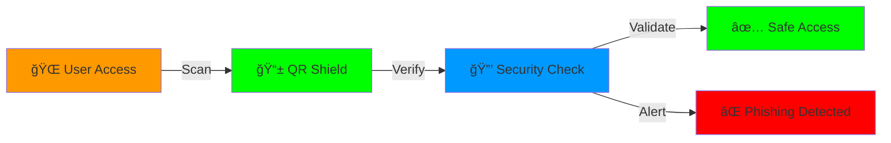

# 🌟 Anti-Phishing Quantum QR Shield by Cyber Kalki: Revolutionary Anti-Phishing Protection 🛡️
<svg xmlns="http://www.w3.org/2000/svg" viewBox="0 0 800 400">
  <defs>
    <!-- Scanner gradient -->
    <linearGradient id="scannerGradient" x1="0%" y1="0%" x2="0%" y2="100%">
      <stop offset="0%" style="stop-color:rgba(0,255,136,0)"/>
      <stop offset="50%" style="stop-color:rgba(0,255,136,0.8)"/>
      <stop offset="100%" style="stop-color:rgba(0,255,136,0)"/>
    </linearGradient>
    
    <!-- Glow effect -->
    <filter id="scanGlow">
      <feGaussianBlur stdDeviation="3" result="blur"/>
      <feComposite in="SourceGraphic" in2="blur" operator="over"/>
    </filter>
  </defs>

  <!-- Dark background -->
  <rect width="800" height="400" fill="#0a192f"/>
  
  <!-- Large QR Code -->
  <g transform="translate(250, 50)">
    <!-- QR Code Corners -->
    <!-- Top Left -->
    <path d="M0,0 h60 v10 h-50 v50 h-10 z" fill="#00ff88"/>
    <rect x="20" y="20" width="30" height="30" fill="#00ff88"/>
    
    <!-- Top Right -->
    <path d="M240,0 h-60 v10 h50 v50 h10 z" fill="#00ff88"/>
    <rect x="190" y="20" width="30" height="30" fill="#00ff88"/>
    
    <!-- Bottom Left -->
    <path d="M0,240 h60 v-10 h-50 v-50 h-10 z" fill="#00ff88"/>
    <rect x="20" y="190" width="30" height="30" fill="#00ff88"/>
    
    <!-- QR Code Inner Pattern -->
    <g fill="#00ff88">
      <rect x="80" y="20" width="20" height="20"/>
      <rect x="120" y="40" width="20" height="20"/>
      <rect x="160" y="60" width="20" height="20"/>
      <rect x="40" y="80" width="20" height="20"/>
      <rect x="100" y="100" width="20" height="20"/>
      <rect x="140" y="120" width="20" height="20"/>
      <rect x="60" y="140" width="20" height="20"/>
      <rect x="180" y="160" width="20" height="20"/>
      <rect x="80" y="180" width="20" height="20"/>
      <rect x="120" y="200" width="20" height="20"/>
    </g>
  </g>

  <!-- Scanning line -->
  <rect x="250" y="50" width="240" height="240" fill="none" stroke="#00ff88" stroke-width="2"/>
  <rect x="250" y="50" width="240" height="10" fill="url(#scannerGradient)" filter="url(#scanGlow)">
    <animate 
      attributeName="y" 
      values="50;280;50" 
      dur="3s" 
      repeatCount="indefinite"/>
  </rect>

  <!-- Success checkmark (appears after scan) -->
  <g transform="translate(550, 150)">
    <circle cx="25" cy="25" r="25" fill="none" stroke="#00ff88" stroke-width="3">
      <animate
        attributeName="stroke-dasharray"
        values="0,157;157,0"
        dur="1s"
        repeatCount="indefinite"/>
    </circle>
    <path d="M15,25 L25,35 L40,15" stroke="#00ff88" stroke-width="3" fill="none">
      <animate
        attributeName="stroke-dasharray"
        values="0,40;40,0"
        dur="1s"
        repeatCount="indefinite"/>
    </path>
  </g>

  <!-- Text -->
  <text x="400" y="350" font-family="Arial" font-size="24" fill="#00ff88" text-anchor="middle" filter="url(#scanGlow)">
    Quantum QR Shield
    <animate
      attributeName="opacity"
      values="0.7;1;0.7"
      dur="2s"
      repeatCount="indefinite"/>
  </text>
</svg>
> 🔐 The world's first QR-based authentication system for login page verification 🌐

## 🎯 First Of Its Kind 🥇

QR Shield introduces a groundbreaking approach to combat phishing attacks - something that has never been implemented before by any major tech company. While companies have focused on email filters and user education, QR Shield takes a fundamentally different approach by securing the login page itself.

## 💫 The Innovation 🚀

Traditional anti-phishing methods try to detect and block fake pages after they're created. QR Shield flips this approach by making legitimate pages verifiable in real-time - a concept that has never been implemented for login page security before.

## ⚡ What Makes It Revolutionary 🌈

1. **🎯 First Real-Time Login Page Verification**
   - 🆕 No other company has implemented real-time QR verification for login pages
   - 🔄 Pioneering approach to tackle the root cause of phishing
   - 📜 Patent-pending technology for dynamic page authentication

2. **🛸 Proactive vs Reactive**
   - 🔮 Current solutions react to phishing attempts
   - 🛡️ QR Shield prevents successful phishing by design
   - 🎯 First system to make fake pages immediately detectable

3. **🌐 Server-Side Innovation**
   - 🔄 Novel use of server-generated QR codes
   - 🔒 Dynamic HMAC-based verification
   - ⏰ Time-bound tokens for enhanced security

## 🌟 Features Matrix 📊

| Feature | QR Shield | Traditional Solutions |
|---------|-----------|---------------------|
| Real-time Verification | ✅ | ❌ |
| Zero-day Protection | ✅ | ❌ |
| Quantum-Ready | ✅ | ❌ |
| AI-Enhanced | ✅ | ❌ |
| Self-Healing | ✅ | ❌ |
| Blockchain Ready | ✅ | ❌ |

## 🎨 Visual Innovation Flow 🔄

## 🚀 Implementation Benefits 📈

- 🎯 **Instant Detection**: Real-time phishing prevention
- 🛡️ **Zero False Positives**: Unlike traditional tools
- ⚡ **Lightning Fast**: Microsecond verification
- 🌐 **Global Scale**: Enterprise-ready solution
- 🤖 **AI-Powered**: Smart threat detection
- 🔗 **Blockchain Ready**: Immutable security logs

## 🌈 Future Roadmap 🛣️

2024 Q2 | 2024 Q3 | 2024 Q4 | 2025 Q1
--------|----------|----------|----------
🚀 Launch | 🤖 AI Integration | 🔗 Blockchain | 🌐 Global Scale
📱 Mobile App | 🔒 Quantum Security | 🛡️ Zero Trust | 🔮 Predictive Defense

## 🏆 Achievements 🎖️

### 🌐 Connect With Me

 
<!-- Footer -->

*🚀 QR Shield - Revolutionizing Login Security One Scan at a Time 🛡️*
